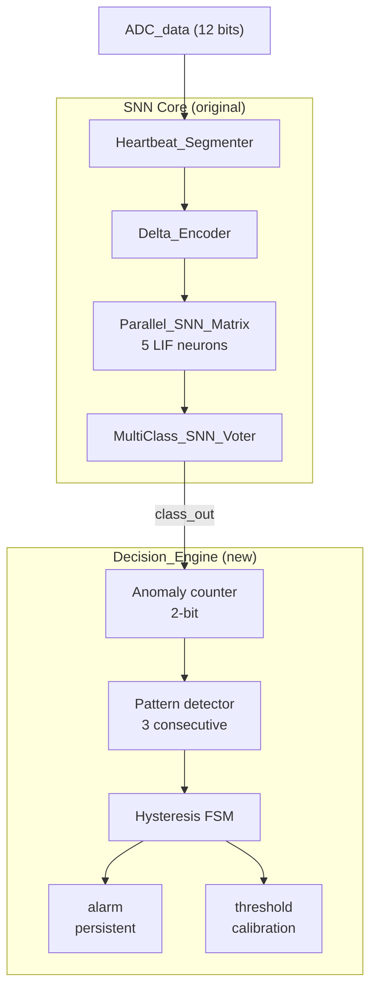

# SNN Arrhythmia Detector with Hysteresis

A Tiny Tapeout project that classifies heartbeats using a Spiking Neural Network (SNN) and detects consecutive anomalies for cardiac arrhythmia alerting.

[](https://tinytapeout.com)
[](LICENSE)
[](test/)

---

## 🎯 Overview

This chip implements an **intelligent cardiac monitor on silicon**. It takes a stream of digitized ECG samples and:

1. **Classifies** each heartbeat into one of five categories, all of this using a Spiking Neural Network.
2. **Detects patterns** of 3 or more consecutive anomalous beats, to reach out a possible arrhythmia.
3. **Raises a persistent alarm** when such a pattern is detected. The alarm will be trigered and stays active until a Normal beat clears it — this is the **hysteresis** behavior.
4. **Adapts** to a patient's baseline through a calibration mode, learning from the registered data to prevent false positive.

This is a **derivative work** based on the original [`snn_lif_neurons_ttsky26c`](https://github.com/davidbroughsmyth/snn_lif_neurons_ttsky26c) project by [David Broughsmyth](https://github.com/davidbroughsmyth). The original project classifies individual heartbeats. This project goes **one step further** by adding a **Decision Engine** that gives the chip **temporal awareness**, and its a big improvement with future aplications on medicine.

---

## 🆚 What's new in this project?

| Feature | Original | This project |
|---|---|---|
| Beat classification (5 classes) | ✅ | ✅ |
| Detects a single anomaly | ✅ | ✅ |
| Detects **consecutive** anomalies | ❌ | ✅ **NEW** |
| **Persistent alarm** with hysteresis | ❌ | ✅ **NEW** |
| **Adaptive threshold** calibration | ❌ | ✅ **NEW** |
| **Test mode** for verification | ❌ | ✅ **NEW** |

The difference between a classifier and a monitoring and warning system: a real cardiac monitor does not just label a beat; it **remembers** what happened and **decides** when to alert, for user safety.

---

## 🏗️ Architecture



### Modules

| Module | Role |
|---|---|
| `project.v` | Tiny Tapeout top-level wrapper |
| `SNN_Heart_Monitor_Top.v` | SNN core orchestrator (original) |
| `Heartbeat_Segmenter.v` | R-peak detector state machine (original) |
| `Delta_Encoder.v` | Waveform delta encoder (original) |
| `Parallel_SNN_Matrix.v` | Array of 5 LIF neurons (original) |
| `Heart_Monitor_Neuron.v` | Single LIF neuron (original) |
| `MultiClass_SNN_Voter.v` | Majority voter with win margin (original) |
| **`Decision_Engine.v`** | **Temporal reasoning, hysteresis, calibration (new)** |

---

## 📌 Pinout

| Pin | Name | Direction | Description |
|---|---|---|---|
| `ui_in[7:0]` | `ADC_data[7:0]` | Input | Lower 8 bits of the 12-bit ADC sample |
| `uio_in[3:0]` | `ADC_data[11:8]` | Input | Upper 4 bits of the 12-bit ADC sample |
| `uio_in[4]` | `sample_en` | Input | Pulse high to submit a new sample |
| `uio_in[5]` | `mode_sel` | Input | 0 = inference, 1 = calibration |
| `uio_in[6]` | `force_class` | Input | 1 = force class from `ui_in[2:0]` (test mode) |
| `uio_in[7]` | — | — | Unused |
| `uo_out[0]` | `alarm` | Output | Persistent arrhythmia alarm |
| `uo_out[1]` | `pattern_detected` | Output | Pulse when 3 consecutive anomalies are detected |
| `uo_out[4:2]` | `class_out` | Output | Classified heartbeat class (3 bits) |
| `uo_out[5]` | `diagnostic_valid` | Output | Indicates the classification is valid |
| `uo_out[6]` | `alarm_strobe` | Output | Short pulse from the original core (debug) |
| `uo_out[7]` | — | — | Unused |

### Heartbeat classes

| Value | Class | Anomalous? |
|---|---|---|
| `3'd0` | Normal | ❌ |
| `3'd1` | Supraventricular | ✅ |
| `3'd2` | Ventricular | ✅ |
| `3'd3` | Fusion | ❌ |
| `3'd4` | Unknown | ✅ |

---

## 🧪 How to test

The design is verified with a **cocotb** testbench. To run it locally:

```bash
# Set up the virtual environment (only once)
python -m venv venv
source venv/bin/activate

# Install dependencies (only once)
pip install cocotb

# Run the tests
cd test
make

Three tests must pass:

| Test | What it verifies |
|---|---|
| `test_reset_state` | After reset, the alarm and pattern detectors are 0 |
| `test_hysteresis_3_anomalies` | **Core logic**: 3 consecutive anomalies activate the alarm; a Normal beat clears it |
| `test_calibration_mode` | Calibration mode does not break the DUT |

The second test uses the `force_class` mode to bypass the SNN and inject specific classes, allowing direct verification of the `Decision_Engine`.

📁 Project structure

tt-snn-heart-monitor-hysteresis/
├── src/                          # Verilog source files
│   ├── project.v                 # Top module (Tiny Tapeout wrapper)
│   ├── SNN_Heart_Monitor_Top.v   # SNN core (original)
│   ├── Decision_Engine.v         # Decision logic (new)
│   ├── Delta_Encoder.v           # Original
│   ├── Heartbeat_Segmenter.v     # Original
│   ├── Heart_Monitor_Neuron.v    # Original
│   ├── MultiClass_SNN_Voter.v    # Original
│   ├── Parallel_SNN_Matrix.v     # Original
│   └── config.json               # LibreLane configuration
├── test/                         # cocotb testbench
│   ├── test.py
│   ├── tb.v
│   └── Makefilem
├── docs/
│   ├── info.md                   # Datasheet
│   ├── arquitectura.md           # Extended architecture documentation
│   └── guia_de_uso.md            # User guide
├── info.yaml                     # Tiny Tapeout metadata
├── README.md                     # This file
└── LICENSE                       # Apache 2.0

🛠️ Design notes 
Technology and tools
Language: Verilog

Simulation: Icarus Verilog + cocotb 2.x

Synthesis: LibreLane / OpenLane with SKY130A PDK

Tile size: 1x1

Utilization: 79.544%

Clock: 40 MHz (25 ns period)

Key implementation details
The synchronization bug we found

The first version of the Decision_Engine had a subtle bug: the alarm was activating one cycle late because the pattern detector used the current value of the shift register instead of the projected one.

The fix was to evaluate the pattern with the incoming class already included:

// Before (buggy): uses stale history
window_full = is_anomaly(history[0]) && is_anomaly(history[1]) && is_anomaly(history[2]);

// After (correct): includes the incoming class
window_would_be_full = is_anomaly(class_in) && is_anomaly(history[0]) && is_anomaly(history[1]);


This is a classic lesson in synchronous design: when a combinational block feeds a register that is updated at the same clock edge, you must think one cycle ahead.

Area optimization

The original design fit in 1x2 tiles, and the requirements of CANELOS is that the project had to fit in a 1x1 tile. To fit in 1x1 , the following optimizations were applied:

Reduced BIT_WIDTH from 16 to 8 bits in the LIF neurons and voter (weights were all multiples of 16), this was because of the las number asociated to this variables was 150, a number that could fit in 8 bits.

Simplified the voter by removing the redundant step_sum logic.

Replaced the Decision_Engine shift register with a 2-bit counter.

Reduced cycle_counter in the Heartbeat_Segmenter from 16 to 8 bits.

Used SYNTH_STRATEGY: "AREA 2" and PL_TARGET_DENSITY_PCT: 80 in LibreLane.

Result: utilization went from 133% (did not fit) to 79.5% in 1x1, achieving the objective.

📚 Documentation
Datasheet

Extended architecture

User guide

📜 License
Licensed under the Apache License, Version 2.0. See LICENSE for details.

The original snn_lif_neurons_ttsky26c project by David Broughsmyth is also licensed under Apache 2.0.

🙏 Credits
Original SNN design: David Broughsmyth — snn_lif_neurons_ttsky26c

Decision Engine, hysteresis, calibration, test mode: Vicente Antonio San Martín Fuentes (2026)

Framework: Tiny Tapeout, cocotb, LibreLane

PDK: SkyWater SKY130A

🎓 Context 
Developed during the CANELOS seminar at Universidad Técnica Federico Santa María (USM), of wich i am a student, in Chile, as part of the Tiny Tapeout workshop, organized by the student initiative CHIPUSM, furthermore, this was one of my goals, to be able to carry out a proyect with a difficulty beyond the basics like this project.

📖 References
Broughsmyth, D. (2025). snn_lif_neurons_ttsky26c. GitHub.

Tiny Tapeout documentation: https://tinytapeout.com

SKY130 PDK documentation: https://skywater-pdk.readthedocs.io